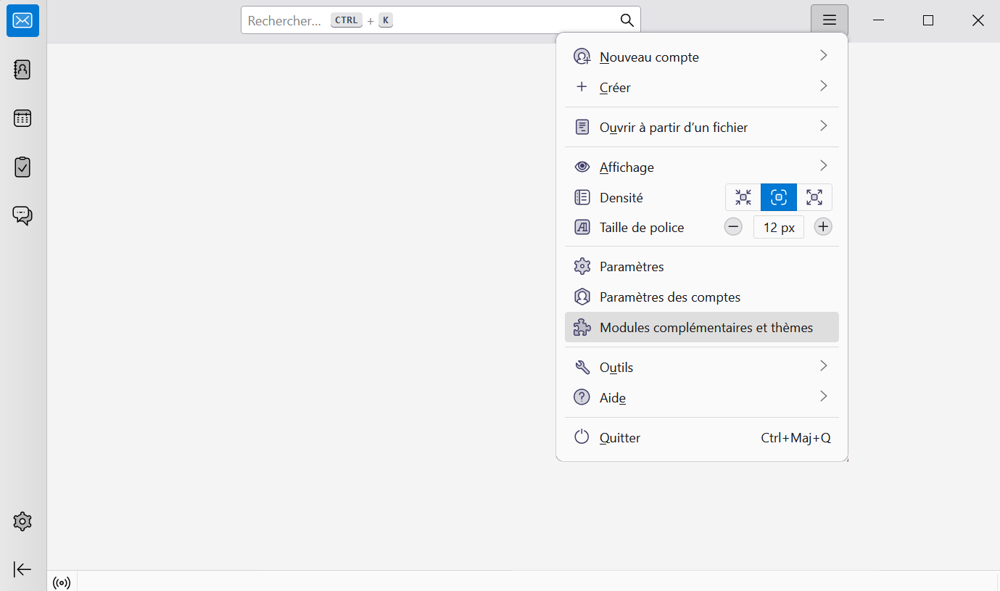
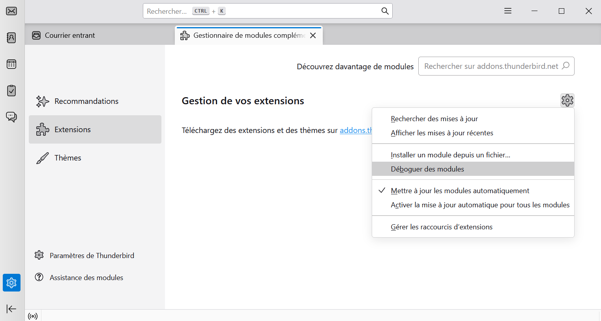
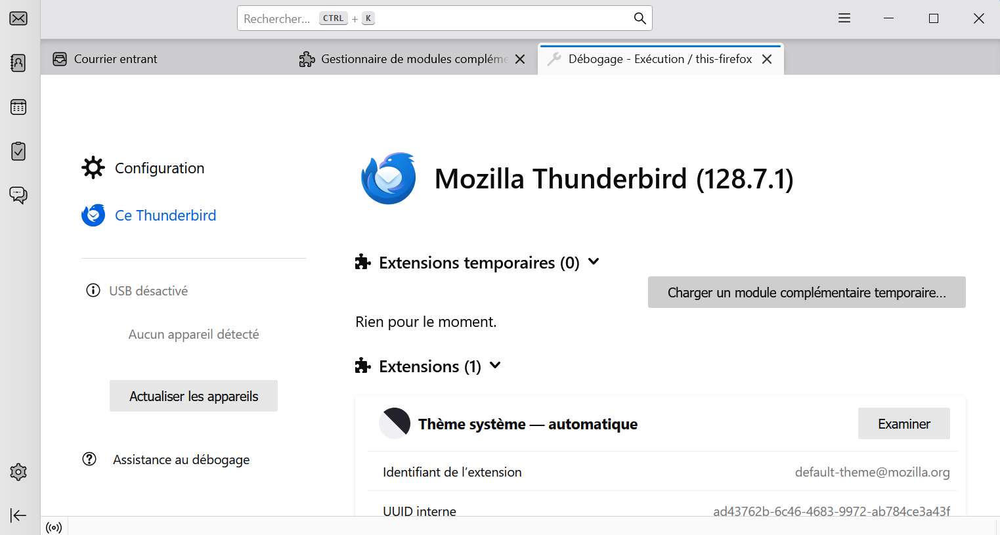
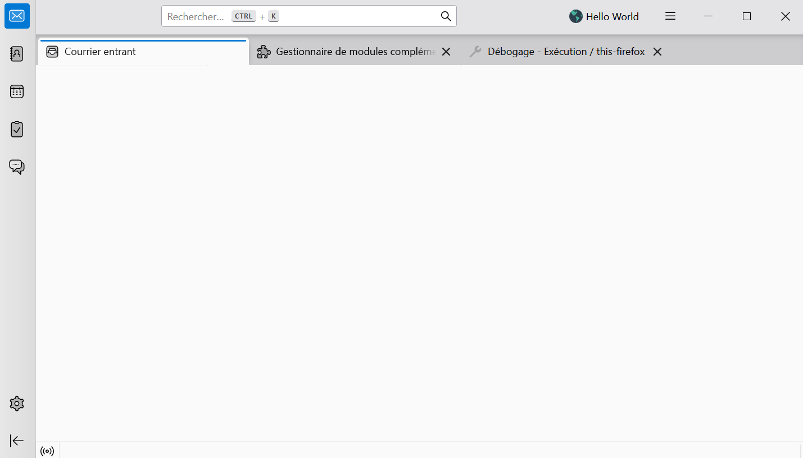

## Interface_graphique_Thunderbird
Interface graphique interactive, intégrée au logiciel de messagerie Thunderbird (extension) permettant d’organiser et visualiser les mails.

Projet réalisé dans le cadre de l'UE BE-SHS de la licence informatique de Université de Toulouse.

Maîtrise d'ouvrage: 
    • Chiara Giraudo

Maîtrise d'oeuvre:
    • Mariama DIALLO
    • Vincent DUBUISSON
    • Yassine LAMRABETE
    • Alex TSAN
    • Petar VUKOSAVLJEVIC

## Comment tester ?
Pour tester le principe de l'extension ThunderBird et de la carte mentale avec la librairie Mind Elexir, suivez les instructions suivantes:

- Ouvrez ThunderBird et allez dans le menu du logiciel (en haut à droite), puis sélectionnez 'Modules complémentaires et thèmes'

  

- Cliquez ensuite sur la roue dentée, puis sur 'Déboguer des modules'

  

- Ensuite, dans 'Extensions temporaires', chargez un module complémentaire temporaire et ouvrez le fichier 'manifest.json' du dossier 'hello_world'.

  

- Enfin, rendez vous dans l'onglet 'Courrier', l'extension devrait s'afficher en haut à droite de l'interface.

  

